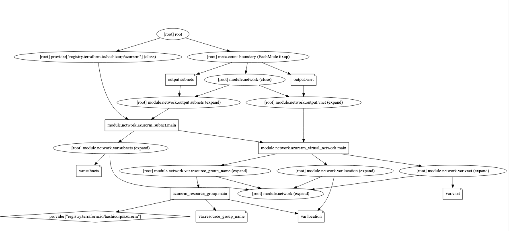

# Code that Can't Be Deployed from Scratch

### Setting Up
1. Copy your `main.tf` and `network/` directory from `Day3/301-refactoring-and-state` into the `Day3/301-common-traps/scratch` directory. We'll be working on this familiar codebase throughout this lab.

### Run the Terraform Workflow
1. Go ahead and deploy your resources by running the Terraform workflow. Troubleshoot any errors or misconfigurations until you can get it to apply.
1. You should now have the same resources deployed as we did in the previous lab.
1. Run `terraform graph` to generate a dependency graph in a GraphViz format. Copy the `digraph` block to your clipboard and paste into an [online GraphViz tool](https://dreampuf.github.io/GraphvizOnline). It will look something like:

    

1. Follow the `var.resource_group_name` dependency into the `azurerm_resource_group` resource.
1. Next, look at the `module.network.var.resource_group_name` dependency. What do you notice about its relationship to the `azurerm_resource_group`?

### Refactor
Next, you'll be refactoring your codebase after the base infrastructure has already been deployed. This simulates a change someone may introduce into a working deployment.
1. Open `301-common-traps/traps/scratch/main.tf`.
1. Edit the `resource_group_name` value that is passed into the `network` module from `azurerm_resource_group.main.name` to `var.resource_group_name`.
1. Add a resource of type [time_sleep](https://registry.terraform.io/providers/hashicorp/time/latest/docs/resources/sleep), and add a `create_duration` attribute with a value of "10s". This will simulate another resource deployment that takes 10 seconds to create.
    ```
    resource "time_sleep" "await" {
      create_duration = "10s"
    }
    ```
1. Add an explicit dependency to your `azurerm_resource_group` to this `time_sleep` resource using the [depends_on](https://www.terraform.io/language/meta-arguments/depends_on) meta-argument.
    ```
    resource "azurerm_resource_group" "main" {
      name     = var.resource_group_name
      location = var.location

      depends_on = [
        time_sleep.await
      ]
    }
    ```

### Run the Terraform Workflow
1. Run the Terraform workflow to apply your infrastructure.
1. Run another `terraform graph` to generate a graph of dependencies and drop into the Online GraphViz tool to visualize it.
    1. Follow the `var.resource_group_name` dependency into the `azurerm_resource_group` resource.
    1. Next, look at the `module.network.var.resource_group_name` dependency. What do you notice about its relationship to the `azurerm_resource_group`?

### Destroy Everything, Run Apply
1. Now you're going to teardown everything with a `terraform destroy` and rebuild it from scratch. This simulates running the same code on a net-new environment. Notice what happens. Why?
    1. Refer to the GraphViz diagrams for help understanding the dependency tree.

### Fix the code so it works from scratch
1. Make the appropriate change(s) so this code deploys successfully from scratch. Be prepared to explain your solution.
